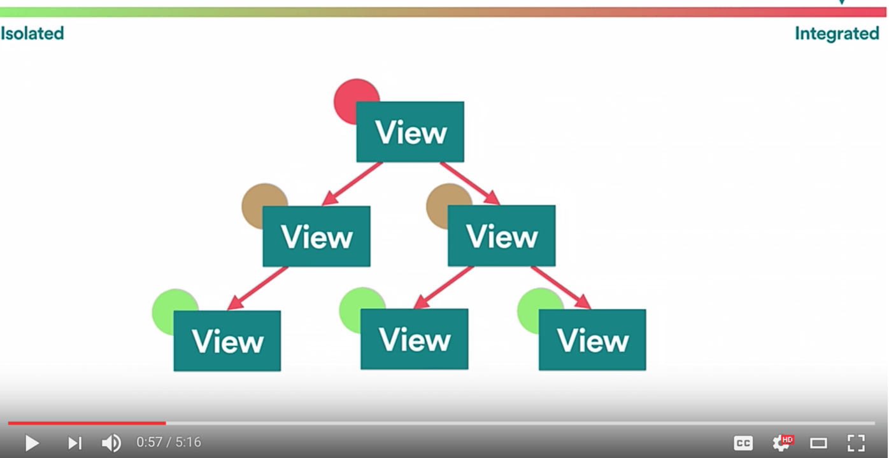
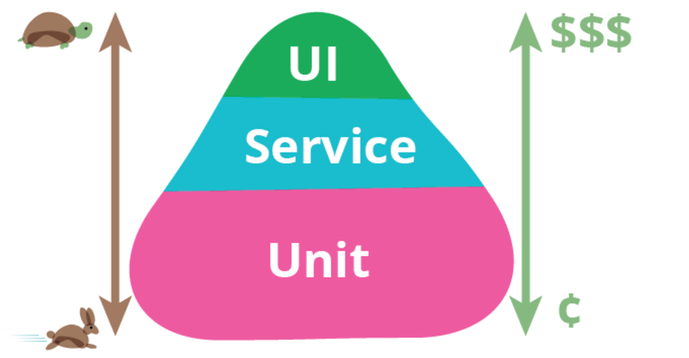

title: 啦啦啦
author:
  name: Thank you
  email: xiaoxu@thoughtworks.com
output: index.html
theme: xuxtc/reveal-cleaver-theme

--
#去UI自动化
##在React+[Redux](http://redux.js.org/)中的尝试

--
###React+Redux的主要特点
* 组件化
* 组件树
* 组件无状态化(no state)，利用store统一管理state


--
###加入redux架构前后的层级对比


--
###突出的问题
* UI自动化功能测试受制于环境(运行os,浏览器等)维护困难，运行缓慢，而且非常容易因为前端变化而被破坏。
* 单元测试覆盖点有限，无法覆盖所有的测试点。

--
###自动化测试金字塔


--
###重要概念
- UI Component : 用户view
- Store : 全局唯一的对象，用来保存state
- Action : 用户操作view时触发
- Reducer : 计算新的state的函数
- Container (Component): 负责一些业务逻辑和connect UI组件

--
###Redux工作流程：
1.  用户操作view触发action
2.  action通知store: state要变化了，调用reducer
3.  reducer计算新的 state应该是啥样，返回新的state给store
4.  store通过react组件把新的state对应的view显示给客户

--
###测什么？
* 各个单独组件能够正常显示DOM元素
* 如果state改变了, 那么我只需要确保相应的view发生了变化
* 如果view发生了改变, 那么我只需要确保相应的state存进了store

--
###帅气的单元测试
1. 简单易懂。最好是BDD风格的，一眼就可以看出你在测试什么，减少维护成本
2. 高覆盖率，研发重构的时候会更有信心
3. 跑的快，不要有额外的工作(例如维护复杂的环境依赖等)
4. 从客户价值(business value)角度出发，确保软件的可交付性。

--
###工具选择
* [JEST](http://facebook.github.io/jest/)
* [Enzyme](http://airbnb.io/enzyme/index.html)测试工具库。

--
###覆盖率配置
```json
  "jest": {
    "collectCoverageFrom" : [
      "**/*.{js,jsx}",
      "!**/coverage/**",
      "!**/store.js",
      "!**/provider.jsx",
      "!**/index.js",
      "!**/webpack.config.js"
    ],
    "coverageThreshold": {
      "global": {
        "branches": 95,
        "functions": 95,
        "lines": 95,
        "statements": 95
      }
    }
  }
```

--
###实现单元测试


--
###实现功能测试
- 用户输入任意字符，输入的同时，会在下方显示出输入的值
- 点击Submit按钮后提交form，更新界面显示
- 点击footer后可以回到首页

--
###还差什么
* 点击某个页面元素后，需要在页面上显示新的区块，并且要加载指定的的css的测试。
* 点击某个link，需要跳转到指定的网站的测试
* 页面跳转
* 探索性测试（manual test)
